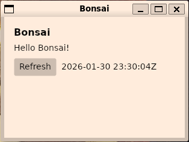

# Bonsai

 

Bonsai is a minimal Avalonia UI template targeting .NET 10 (net10.0). This repository contains a small modular project layout (Core, Services, UI, Tests) and CI-ready defaults for producing self-contained desktop artifacts.

Getting started (local):

Prerequisites:

- .NET 10 SDK (verify with `dotnet --list-sdks | grep '^10\.'`)
- `make` and `bash`
- PowerShell (`pwsh`) if you plan to build the MSI locally

Common commands (from repo root):

- Build: `make build`
- Test (headless UI tests): `make test`
- Run UI locally: `make run` (runs `dotnet run --project src/Bonsai.UI`)
- Publish for platforms: `make publish-all` (produces self-contained outputs under `publish/`)
- Package artifacts: `make package-all` (produces AppImage/MSI/dmg or fallbacks under `artifacts/`)

Notes:

- CI will produce self-contained, single-file builds for linux-x64, win-x64, and osx-x64.
- Windows packaging uses WiX to produce an MSI (installer/Bonsai.Product.wxs).
- Headless UI tests use `Avalonia.Headless` and run in CI with `AVALONIA_HEADLESS=1`.

Releases:

- Create a git tag like `v1.2.3` and push it to trigger `.github/workflows/release.yml` which builds artifacts and creates a GitHub Release with packaged installers.

Replace `SchwartzKamel/bonsai` in the badge URLs with your GitHub repo path to enable actionable badges.
